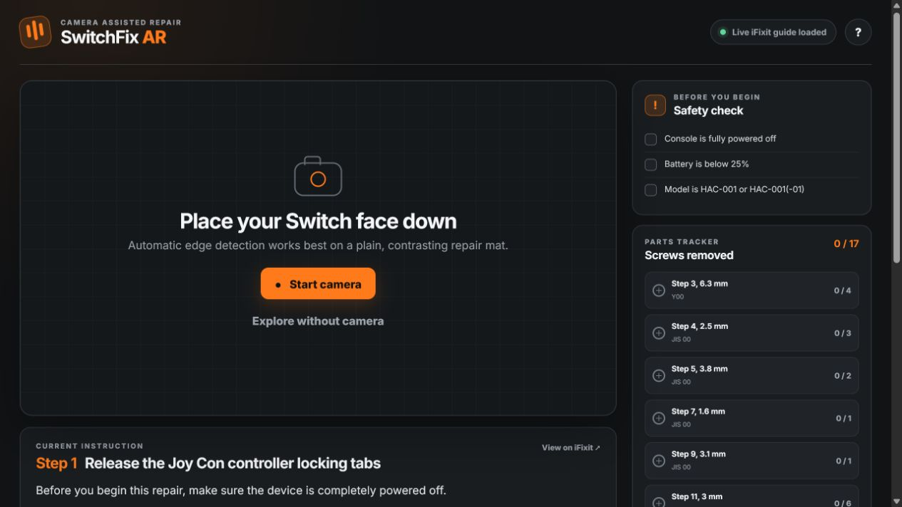

# SwitchFix AR

[](#project-status)
[](#testing)
[](LICENSE.md)
[](.github/workflows/deploy-pages.yml)

SwitchFix AR is a camera-assisted web guide for replacing the battery in an original Nintendo Switch. It combines a guided repair workflow with browser-based computer vision to place screw, action, and component markers over the console in real time. Loose red/orange and blue Joy-Cons are also labelled automatically when their colour and shape are visible in the camera frame.

> [!IMPORTANT]
> **Work in progress:** this is an active portfolio prototype, not a finished repair product. Automatic tracking, colour-based Joy-Con identification, device-revision coverage, and screw-level alignment are still being validated. Always compare overlays with the linked iFixit reference image before removing hardware.

[View the live demo](https://ishaanp3.github.io/switchfix-ar/) · [Read the source repair guide](https://www.ifixit.com/Guide/Nintendo+Switch+Battery+Replacement/112995)



## Why this project

Repair instructions are usually presented as static photos. As new EU rules encourage more replaceable batteries, I wanted to explore a clearer workflow for original Nintendo Switch owners replacing an aging battery. SwitchFix AR detects the device, estimates its four-corner perspective, and transforms normalized guide coordinates into live camera positions. The interface keeps the safety checklist, current tool, screw lengths, repair progress, and iFixit reference imagery visible so the user can cross-check every overlay.

The result is a lightweight, install-free prototype that runs entirely in the browser and can be hosted as a static site.

## Highlights

- 20-step Nintendo Switch battery-replacement workflow
- Automatic dark-device detection tuned for an angled laptop-camera view
- Four-corner perspective projection with temporal smoothing
- Pyramidal Lucas-Kanade optical flow through a vendored 67 KB JSFeat runtime
- Automatic re-acquisition plus a manual four-corner alignment fallback
- Separate top, bottom, left-rail, and right-rail camera views
- 17 screw markers measured from the red circles in the official iFixit images
- Repairer-facing rear/interior orientation with the microSD slot and kickstand at top-right
- Per-view screw completion, safety checks, tool prompts, and progress persistence
- Live iFixit guide loading with a bundled offline fallback
- Adaptive brightness threshold plus a four-condition live calibration lab
- Component-learning and perspective-projected AR overlays for Joy-Cons outside the console, backplate, microSD reader, shield plate, and battery
- Continuous on-device colour/shape detection for loose red/orange and blue Joy-Cons
- Representative animated reassembly sequence with mirrored Joy-Cons and right-side internal microSD placement
- Step-aware fragile-connector and high-risk battery warnings in the video feed
- Responsive, build-free static architecture suitable for GitHub Pages
- On-device camera processing; camera frames are not uploaded by the app

## How tracking works

```text
Camera frame
    -> grayscale + dark-component segmentation
    -> console candidate scoring by shape, area, orientation, and position
    -> four-corner perspective estimate
    -> JSFeat optical-flow tracking between detections
    -> temporal smoothing and periodic re-acquisition
    -> projected screw and action overlays
    -> parallel red/orange + blue colour masks
    -> loose Joy-Con shape filtering and labels
```

Three detection profiles cover the rear/interior, horizontal top and bottom edges, and vertical Joy-Con rails. If automatic detection is unreliable, the user can tap the four console corners in order and continue with the same perspective-projection system.

## Project status

Current version: **v2.4.2 — active prototype**

Completed:

- [x] Responsive repair interface and 20-step guide
- [x] Rear, interior, edge, and rail tracking profiles
- [x] Optical-flow tracking and automatic re-detection
- [x] Manual alignment fallback
- [x] Live lighting diagnostics and alignment practice trials
- [x] Five-component learning mode and perspective-projected component regions
- [x] Automatic red/orange and blue loose Joy-Con labelling
- [x] Repairer-facing top-right microSD and kickstand geometry
- [x] Representative reassembly animation
- [x] On-camera fragile-cable and high-risk-step warnings
- [x] iFixit source-step and image integration
- [x] Automated guide-data and projection tests
- [x] GitHub Pages deployment workflow

Planned:

- [ ] Collect a larger camera-angle and lighting validation set
- [ ] Add model-aware support for Switch Lite and Switch OLED
- [ ] Replace heuristic detection with a labeled keypoint or segmentation model
- [ ] Add calibration confidence history and downloadable session reports
- [ ] Complete hands-on validation across the full repair sequence
- [ ] Expand automated browser and accessibility testing

## Technical decisions

This release uses deterministic computer vision instead of a small, weakly trained neural model. A reliable ML upgrade needs labeled keypoints or masks for the rear, interior, top, bottom, left rail, and right rail—not miscellaneous web images. The current architecture keeps detection replaceable while preserving the perspective overlay and repair workflow.

Official iFixit video and step imagery were used as repair references for terminology, order, and approximate component regions. The app does not download or claim to train a model from unlabelled YouTube footage; its component overlays are stage-aware geometric guides attached to the tracked console.

Loose Joy-Con identification is a lightweight, on-device heuristic rather than a trained classifier. It combines saturated red-to-orange or blue-to-cyan colour masks with controller-like shape and size filtering, and only labels candidates that are fully in frame. This keeps camera frames private and makes the prototype easy to host, but strong background colours can still cause false positives.

The fan-foam removal instruction from iFixit step 12 is intentionally omitted. Later app steps retain their original iFixit source mapping so live text and reference images remain aligned.

## Run locally

Camera access requires HTTPS or `localhost`.

```bash
npm start
```

Open [http://localhost:8080](http://localhost:8080) in a current Chrome, Edge, Safari, or Firefox browser.

If Node.js is unavailable, serve the repository with another static server, for example:

```bash
py -m http.server 8080
```

## Testing

```bash
npm test
```

The 14-test suite checks the 20-step flow, omitted fan-foam instruction, all 17 unique screw IDs, iFixit coordinates, perspective math, top-right repair orientation, external Joy-Con regions, red/orange and blue colour detection, internal right-side exploded-view placement and mirroring, lighting adaptation, risk metadata, and static UI wiring.

## Camera test checklist

- Use an original HAC-001 or HAC-001(-01) Switch; Lite and OLED are not yet supported.
- Place the console on a plain, contrasting surface in bright, even lighting.
- Keep the complete target surface inside the dashed guide.
- For rear/interior views, the logo should appear upside down and the microSD slot and kickstand should be top-right from the repairer's camera view.
- Keep the visible edge horizontal for top/bottom steps and the rail vertical for side steps.
- Press **Re-scan** after changing views, or use **Tap corners** if detection cannot lock.
- Open **Training lab** and record the even, dim, bright, and slight-angle trials in the room where the repair will happen.
- Use **Identify components** to review the expected repair stage before enabling a component overlay.
- Keep loose Joy-Cons fully visible on a neutral background; red can range toward orange, while blue can range toward cyan.
- Verify every orange marker against the official reference image before removing a screw.

## Deployment

The repository includes a GitHub Actions workflow that publishes the static site to GitHub Pages from `main`. No bundler, build output, API key, or server deployment is required.

## Project structure

```text
.
|-- .github/workflows/deploy-pages.yml
|-- docs/switchfix-ar-preview.png
|-- src/
|   |-- app.js
|   |-- guide-data.js
|   |-- tracking.js
|   `-- training-data.js
|-- test/app.test.mjs
|-- vendor/
|   |-- jsfeat-min.js
|   `-- JSFEAT-LICENSE.txt
|-- index.html
|-- styles.css
|-- server.mjs
|-- package.json
`-- README.md
```

## Attribution and safety

Guide content and reference images come from [iFixit Guide 112995](https://www.ifixit.com/Guide/Nintendo+Switch+Battery+Replacement/112995) and remain subject to iFixit's licensing and terms. JSFeat is redistributed under its MIT license in [`vendor/JSFEAT-LICENSE.txt`](vendor/JSFEAT-LICENSE.txt).

This project is independent and is not affiliated with or endorsed by Nintendo or iFixit. Nintendo Switch is a Nintendo trademark. Device repair can damage hardware or cause injury; this prototype is an educational visual aid and does not replace qualified repair guidance.

## Contributing

Focused bug reports and reproducible camera-tracking observations are welcome. See [CONTRIBUTING.md](CONTRIBUTING.md) before opening an issue or proposing a change.

## License

Original project code is available under the MIT License. See [LICENSE.md](LICENSE.md) for source, third-party content, and trademark details.
